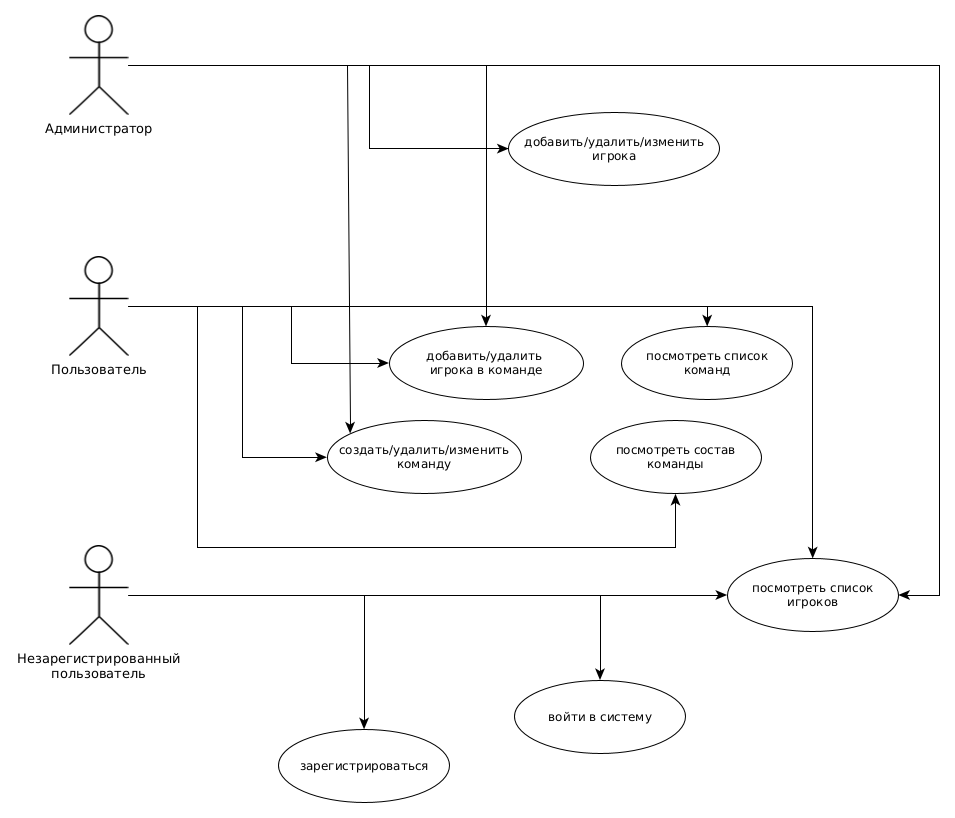
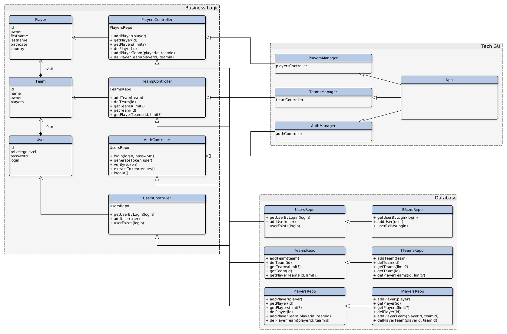

## ППО

1. Программа для создания составов по DOTA 2 

2. Данное приложение позволит создавать и просматривать  командные составы по дисциплине DOTA 2

3. Конструктор-генератор по созданию командных составов по дисциплине DOTA 2

4. Проведённый анализ не выявил аналогичных решений, т.к. все конструкторы преследуют сугубо аналитическо-практические цели: пики+контрпики+синергия. Рядовой пользователь может лишь просматривать составы без возможности создания

5. Пока что нет ни одного конструктора, в котором можно было бы свободно создавать и просматривать данные по командным составам, существующие решения нацелены на аналитику и не имеют возможности редактирования для сторонних пользователей

6. Use-Case

7. ER-диаграмма сущностей

8. Архитектурные характеристики

* Безопасность
* Масштабируемость
* Быстродействие (оптимизация запросов)
* Надёжность
* Отказоустойчивость
* Качество работы

9. Web SPA Cross-platform app

* TypeScript - backend
* ReactJS - frontend
* Jest - testing
* PostgreSQL - db
* pgadmin - db admin
* nginx - proxy server
* docker - deploy app

10. UML-диаграмма технологического UI

