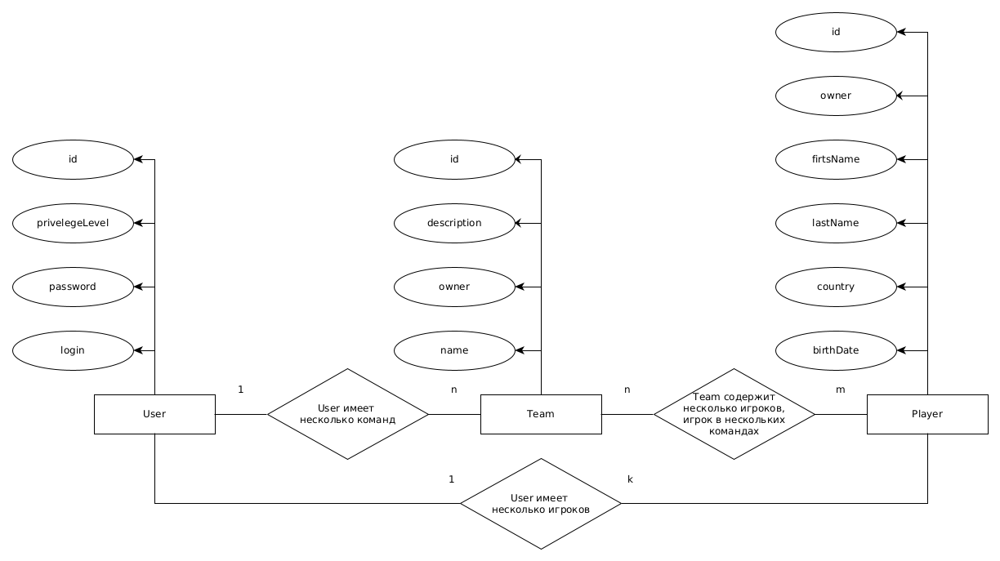

## ППО -> WEB

a. Цель работы, решаемая проблема/предоставляемая возможность

Конструктор-генератор для создания составов по DOTA 2. Все существующие на данный момент решения преследуют сугубо аналитическо-практические цели: пики+контрпики+синергия. Рядовой пользователь может лишь просматривать составы без возможности создания. Данное приложение позволит создавать и просматривать командные составы по дисциплине DOTA 2.

b. Краткий перечень функциональных требований

* Безопасность
* Масштабируемость
* Быстродействие (оптимизация запросов)
* Отказоустойчивость
* Качество работы (удобность)

c. Use-Case

d. BPMN диаграмма основных бизнес-процессов

e. Примеры описания основных пользовательских сценариев

* Регистрация
* Авторизация
* Посмотреть список команд
* Посмотреть список игроков
* Посмотреть команды игрока
* Посмотреть состав команды
* Создать/удалить/изменить команду
* Добавить/изменить/удалить игрока
* Добавить/удалить игрока в команде

f. ER-диаграмма сущностей

g. Диаграмма БД

h. Компонентные диаграммы системы

Диаграмма компонентов приложения

UML-диаграмма технологического UI

UML-диаграмма всего приложения

i. Экраны будущего web-приложения

Фронтенд уже есть...
